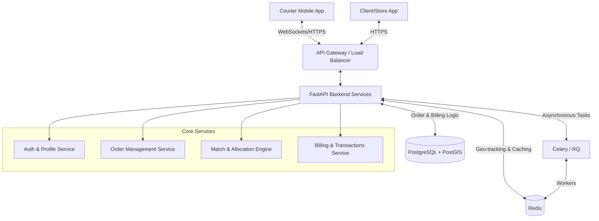

# Shopla Express - Kuryer Ilovasi Loyihasi

## 1. Executive Summary
Ushbu hujjat Express Yetkazib berish (Delivery) tizimining to'liq arxitekturaviy dizaynini o'z ichiga oladi. Tizimning asosiy maqsadi kuryerlar va buyurtmalar o'rtasidagi jarayonni avtomatlashtirish, real vaqt rejimida (real-time) geolokatsiya kuzatuvi orqali eng optimal kuryerni aniqlash, Cash on Delivery (COD) to'lovlarini xavfsiz boshqarish va kuryerlarning virtual billing balansini nazorat qilishdir. Asosiy e'tibor tranzaksiyalar yaxlitligi (ACID), tezkor kuryer qidiruv algoritmlari (Match & Freeze) va tizim masshtablanuvchanligiga qaratilgan.

## 2. High-Level Architecture Diagram
Tizim komponentlarining umumiy ishlash oqimi va munosabatlari:



## 3. Database Schema Design (PostgreSQL / PostGIS)

Tizim relyatsion va fazoviy (spatial) ma'lumotlarni saqlash uchun **PostgreSQL + PostGIS** dan foydalanadi.

### 3.1 `couriers` (Kuryerlar)
* `id` (UUID, PK)
* `full_name` (Varchar)
* `phone_number` (Varchar, Unique)
* `billing_balance` (Decimal, default: 0.0) - Kompaniya oldidagi qarzdorlik/balans
* `is_active` (Boolean) - Tizimda tasdiqlanganligi
* `created_at` (Timestamp)

### 3.2 `courier_shifts` (Smenalar / Liniya)
* `id` (UUID, PK)
* `courier_id` (UUID, FK -> couriers.id)
* `status` (Enum: 'OFFLINE', 'ONLINE')
* `declared_cash` (Decimal) - Liniyaga chiqqanda kiritilgan naqd pul
* `frozen_cash` (Decimal, default: 0.0) - Muzlatilgan naqd pul
* `current_location` (Geometry(Point, 4326)) - Kuryerning joriy lokatsiyasi (PostGIS)
* `started_at` (Timestamp)
* `ended_at` (Timestamp, Nullable)

### 3.3 `orders` (Buyurtmalar)
* `id` (UUID, PK)
* `store_id` (UUID, FK)
* `courier_id` (UUID, FK -> couriers.id, Nullable)
* `pickup_location` (Geometry(Point, 4326))
* `delivery_location` (Geometry(Point, 4326))
* `order_price` (Decimal) - Buyurtma tan narxi (COD uchun)
* `delivery_fee` (Decimal) - Yetkazib berish xizmati haqi
* `status` (Enum: 'PENDING', 'ASSIGNED', 'PICKED_UP', 'DELIVERED', 'CANCELED')
* `created_at` (Timestamp)

### 3.4 `billing_transactions` (Tranzaksiyalar)
* `id` (UUID, PK)
* `courier_id` (UUID, FK -> couriers.id)
* `order_id` (UUID, FK -> orders.id, Nullable)
* `amount` (Decimal) - Tranzaksiya summasi (Minus yoki Plyus)
* `type` (Enum: 'DELIVERY_FEE_DEDUCTION', 'TOP_UP', 'WITHDRAWAL')
* `description` (Varchar)
* `created_at` (Timestamp)

## 4. Core Algorithms & Workflows

### 4.1 Liniyani Yoqish (Go Online)
1. Kuryer ilovada "Go Online" tugmasini bosadi.
2. Tizim `couriers.billing_balance` ni tekshiradi. Agar balans minimal limitdan past bo'lsa (masalan, -50,000 so'm), liniyaga chiqish rad etiladi.
3. Agar balans yetarli bo'lsa, tizim `declared_cash` kiritishni so'raydi.
4. `courier_shifts` jadvalida yangi yozuv yaratiladi, `status = 'ONLINE'`, `declared_cash` kiritilgan summaga teng, `frozen_cash = 0`.

### 4.2 Kuryer Qidirish va Saralash (Match & Freeze)
Buyurtma kelib tushganda, tizim geolokatsiya va naqd pul miqdori bo'yicha eng mos kuryerni qidiradi.

**Kuryer qidirish uchun taxminiy SQL / PostGIS so'rovi:**
```sql
SELECT 
    cs.courier_id,
    ST_Distance(cs.current_location, ST_SetSRID(ST_MakePoint(:pickup_lon, :pickup_lat), 4326)) as distance
FROM 
    courier_shifts cs
JOIN 
    couriers c ON c.id = cs.courier_id
WHERE 
    cs.status = 'ONLINE'
    AND (cs.declared_cash - cs.frozen_cash) >= :order_price
    AND ST_DWithin(cs.current_location, ST_SetSRID(ST_MakePoint(:pickup_lon, :pickup_lat), 4326), :search_radius_meters)
ORDER BY 
    distance ASC
LIMIT 5;
```

**Muzlatish (Freeze) tranzaksiyasi:**
Kuryerga buyurtma biriktirilganda (`ASSIGNED`), ACID tranzaksiya doirasida:
1. `orders.status = 'ASSIGNED'` ga o'zgaradi.
2. `courier_shifts.frozen_cash = courier_shifts.frozen_cash + order_price` qilinadi.

### 4.3 Billing va Tranzaksiyalar Ketma-ketligi (Order Delivered)
Kuryer tovarlarni yetkazib bergach (`DELIVERED`):
1. `courier_shifts.frozen_cash` dan `order_price` ayiriladi.
2. `courier_shifts.declared_cash` dan `order_price` ayiriladi (chunki kuryer bu pulni magazinga berdi).
3. `couriers.billing_balance` dan `delivery_fee` miqdoridagi xizmat haqi ayiriladi.
4. `billing_transactions` jadvaliga `DELIVERY_FEE_DEDUCTION` turidagi yozuv qo'shiladi.

## 5. Technology Stack Recommendations

* **Backend API:** **Python / FastAPI** (Asinxron ishlash va WebSockets uchun optimal)
* **Database:** **PostgreSQL + PostGIS** (ACID tranzaksiyalar va geolokatsion so'rovlar uchun)
* **Caching & Message Broker:** **Redis** (Kuryer koordinatalarini real vaqtda yangilash va navbatlar uchun)
* **Real-time Communication:** **WebSockets** (Buyurtmalarni tezkor uzatish uchun)

---

## 6. Kuryerni Ro'yxatdan O'tkazish Ketma-ketligi (Registration Flow)

### 6.1 Telefon raqamini kiritish
* Kuryer ro'yxatdan o'tish (Register) oynasiga kiradi.
* O'zining faol telefon raqamini kiritadi (masalan, +998 90 123 45 67).
* Tizim bu raqam avval ro'yxatdan o'tgan yoki o'tmaganligini tekshiradi va davom etishga ruxsat beradi.

### 6.2 Validatsiya va parol o'rnatish
* **Validatsiya (Tasdiqlash):** Telefon raqamiga SMS orqali bir martalik kod (OTP) keladi. Kuryer ushbu kodni ilovaga kiritib, telefon raqamini tasdiqlaydi.
* **Parol yaratish:** Raqam tasdiqlangach, kuryer o'z hisobiga kelajakda kirish uchun yangi parol o'rnatadi. Parolni takroran kiritib tasdiqlash so'raladi.

### 6.3 Pasport ma'lumotlari va rasmlari (Verifikatsiya)
* Kuryer tizimda rasmiy ishlashi uchun shaxsini tasdiqlashi kerak bo'ladi.
* **Pasport (yoki ID karta) old qismi:** Ilova kuryerdan pasportning yuz tomoni (rasmi va asosiy ma'lumotlari bor qismi)ni rasmga olishni yoki galereyadan yuklashni so'raydi.
* **Pasport (yoki ID karta) orqa qismi:** Shu tarzda pasportning orqa qismini ham (yashash manzili kabi ma'lumotlar bilan) rasmga olib yuklaydi.
* Yuklangan hujjatlar xavfsiz tarzda serverga yuboriladi va admin tomonidan tekshirilishi uchun jo'natiladi.

> **Eslatma:** Ushbu ro'yxatdan o'tish ma'lumotlari yig'ilgandan so'ng, kuryer akkaunti "kutilmoqda" (pending) holatiga o'tadi. Administrator tekshirib tasdiqlagach, u to'liq faol holatga (active) o'tadi.
